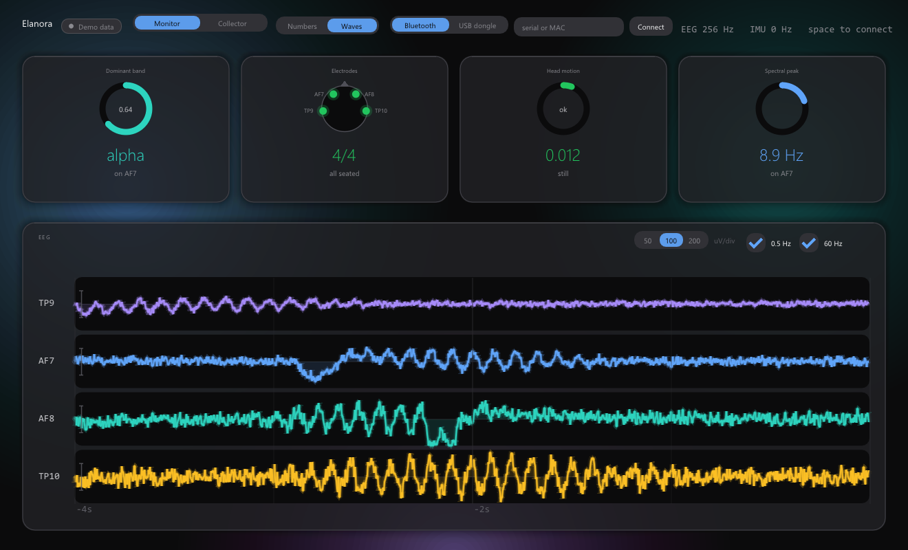
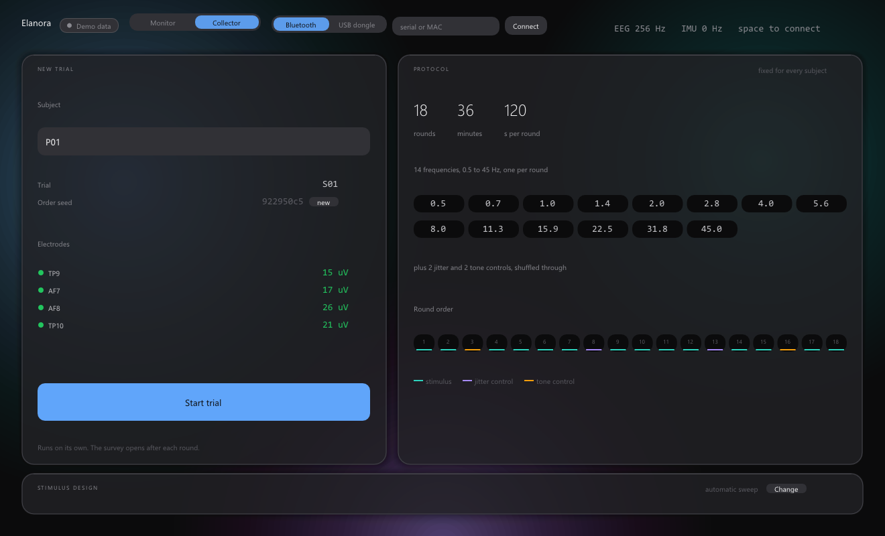
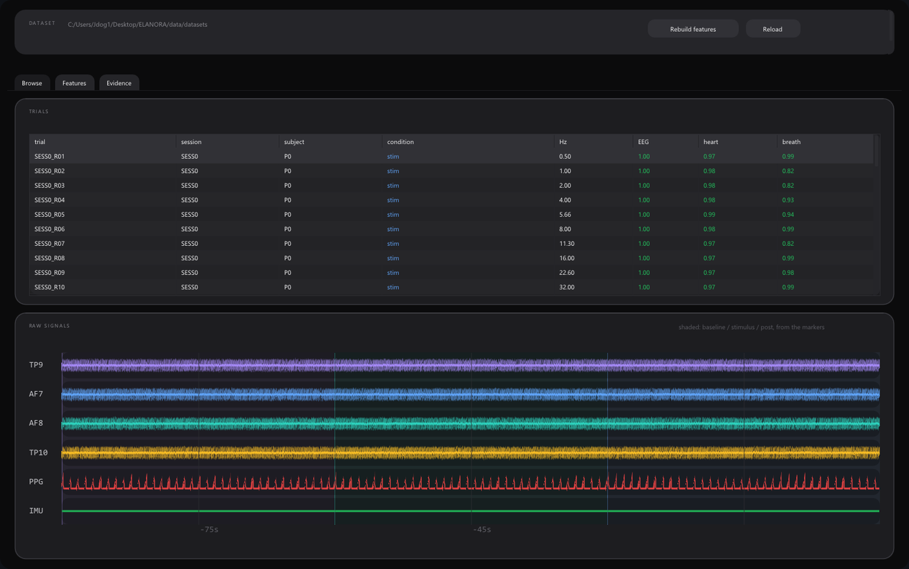
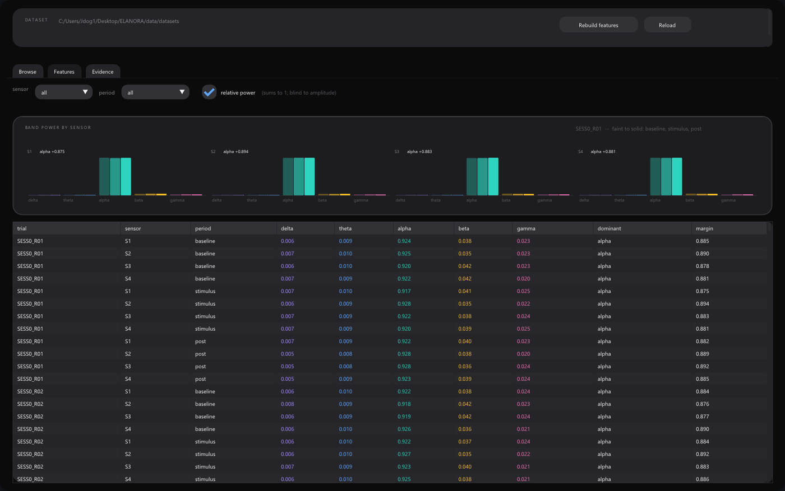
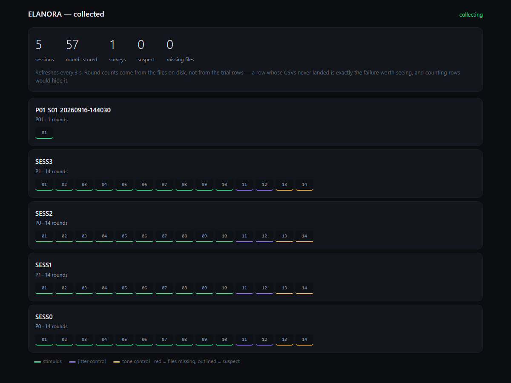

# ELANORA

**Does audio stimulus frequency change brain, heart or breathing activity — and if so, which frequency produces a desired state?**

A Muse 2 EEG research system. It records controlled trials under isochronic audio, extracts physiological features, tests whether frequency predicts anything at all, and only then inverts the models to recommend a frequency.



## The principle it is built around

**The system must be able to show that frequency does nothing.**

An optimizer that always returns a frequency is worthless if frequency turns out not to predict anything. So statistical evidence *gates* the recommendation rather than decorating it, and the optimizer is allowed to answer **"no suitable frequency found."**

Three refusal paths, all of which must pass:

| Gate | Refuses when |
|---|---|
| **Evidence** | No statistically supported frequency effect (FDR-corrected across 22 outcomes) |
| **Trained range** | The candidate lies outside what was actually measured |
| **Effect size** | The predicted change is smaller than 2× the noise on control trials |

If every outcome reads `NoEvidence`, that is a **valid result**.

## How it works

```
  iPhone (Bluefy)                        PC
  ┌────────────────────┐          ┌────────────────────┐
  │ Web Bluetooth      │          │ elanora_serve      │
  │ stimulus + protocol│ ─HTTPS─> │ receives rounds    │ ──> data/datasets/
  │ live signal check  │          └────────────────────┘          │
  └─────────┬──────────┘                                          v
            │ BLE                              elanora_data ──> elanora_models
       Muse 2 headset                          features +        train +
                                               evidence gate     recommend
```

The phone runs the session because acquisition needs a Bluetooth radio, and it generates the audio locally — a wifi round trip in the stimulus path would put jitter on the one timing the experiment most depends on. The PC stores and analyses.

### Verified on hardware

One recorded round, straight off the headset:

```
markers   exactly 30.000 s apart across baseline / stimulus / post
EEG       23,271 samples · 90.9 s · 256.0 Hz · zero dropped packets
          TP9 33 µV   AF7 13 µV   AF8 20 µV   TP10 36 µV
PPG       64.0 Hz, clear pulse waveform
IMU       52.0 Hz, 0.94-1.02 g
```

## Status

Complete and tested end to end. Not yet a finished study — that needs subjects.

| | |
|---|---|
| Acquisition, stimulus, protocol, storage | done, hardware-verified |
| Feature extraction, evidence gate, models, optimizer | done, 260 C++ tests |
| Phone collector | done, 90 browser tests |
| **Data collected** | **1 round — the pipeline proof, not a dataset** |
| **Remaining** | ≥4 subjects × ≥2 sessions, then the evidence gate decides whether any of it means anything |

The analysis half has only ever run on synthetic fixtures with a planted effect. It finds that effect and refuses when there is none, which is the most that can be claimed before real sessions exist.

## Screenshots

**Collector** — 18-round protocol, shuffled order with controls distributed, pre-flight electrode check


**Trial detail** — raw EEG, PPG and IMU with the periods shaded from the markers


**Band power** — per sensor across baseline, stimulus and post


**Collection status** — rounds counted from files on disk, not from trial rows


## Quick start

```bash
cmake -B build -S .
cmake --build build --config Release
ctest --test-dir build -C Release     # 260 tests
```

Run a session:

```bash
./build/bin/Release/elanora_serve --port 8080 --web web --root data/datasets
```

It prints a write token and the LAN URL. Open that on the phone, connect the headset, check the electrodes, press Start. Rounds upload as they finish; watch them land at `/data.html`.

Then analyse:

```bash
./build/bin/Release/elanora_data      # features + evidence gate
./build/bin/Release/elanora_models    # train, then invert
```

Browser tests live at `/tests.html` — 90 of them, including a numerical conformance check between the browser and C++ stimulus generators.

## Layout

| Folder | Role |
|---|---|
| `common/` | Shared types, CSV layer, UI shell |
| `device/` | Muse 2 device I/O, signal quality, `muse_monitor` |
| `collector/` | Stimulus generation, trial runner, protocol constants |
| `data/` | Features, quality control, statistics, the evidence gate |
| `models/` | Ridge/GP models, grouped validation, forward and inverse |
| `server/` | `elanora_serve` — hosts the phone app, receives recordings |
| `web/` | The phone collector |
| `tools/` | Developer tools, not shipped |

## Documentation

| | |
|---|---|
| **[SETUP](docs/SETUP.md)** | Build, run a session, iOS specifics, troubleshooting |
| **[ARCHITECTURE](docs/ARCHITECTURE.md)** | Inputs and outputs per stage in pseudocode, hot paths, extension points |
| **[DESIGN](docs/DESIGN.md)** | The protocol and the reasoning behind it |
| **[PROJECT STRUCTURE](docs/PROJECT_STRUCTURE.md)** | Every folder and what lives in it |
| [specs](docs/specs/) · [plans](docs/plans/) | Design records from during the build |

## Built with

C++20 · CMake · BrainFlow · Dear ImGui + ImPlot · Eigen · Catch2 · miniaudio · cpp-httplib · Web Bluetooth · Web Audio

No Python or Node in the shipped system.

## License

[MIT](LICENSE)
